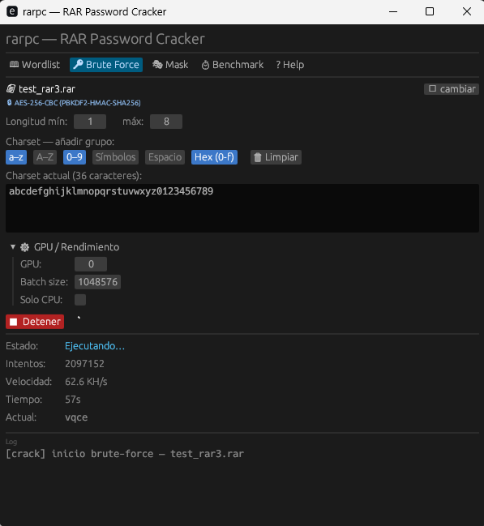

# rarpc — RAR Password Cracker

Crackeador de contraseñas para archivos `.rar` con aceleración GPU mediante CUDA.  
GPU-accelerated RAR password cracker using CUDA.



---

## Español

### Características

- **RAR 5** (AES-256 + PBKDF2-SHA256) — GPU + fallback CPU
- **RAR 3** (AES-128 + SHA-1 KDF) — GPU + fallback CPU
- **RAR 1.5** — filtro GPU probabilístico + verificación estricta CPU

### Rendimiento (RTX 4060 Ti 8 GB)

| Formato  | Velocidad     | Notas |
|----------|---------------|-------|
| RAR 5    | **68 KH/s**   | Saturación ALU, techo CUDA C |
| RAR 3    | **~83 KH/s**  | Kernel largeblock por defecto |
| RAR 1.5  | **6.69 MH/s** | Filtro GPU (89× vs CPU) |

### Modos de ataque

| Modo        | Descripción |
|-------------|-------------|
| Wordlist    | Diccionario de palabras |
| Brute force | Fuerza bruta con charset configurable |
| Mask        | Máscaras `?l ?u ?d ?s ?a ?h` |
| Rules       | Reglas de transformación (subconjunto compatible) |
| Markov      | Modelo de trigramas, mejor-primero |
| Combinator  | Concatenación doble y triple de palabras |

### Requisitos

- Windows 10/11 x64
- [CUDA Toolkit 12.x](https://developer.nvidia.com/cuda-downloads)
- [Visual Studio Build Tools 2022](https://visualstudio.microsoft.com/downloads/#build-tools-for-visual-studio-2022) (componente MSVC C++)
- GPU NVIDIA Ada Lovelace (SM 89) o compatible — otras arquitecturas: cambiar `-arch` en `build.rs`
- Rust stable (`rustup`)

### Compilar

```bash
git clone https://github.com/Unmateria/rarpc.git
cd rarpc
cargo build --release
```

El sistema de compilación (`build.rs`) localiza automáticamente `nvcc` y `cl.exe` de Visual Studio 2022. Si CUDA no está en el PATH, asegúrate de que el CUDA Toolkit esté instalado correctamente.

### Uso

```
rarpc <archivo.rar> [opciones de ataque]
```

**Ejemplos:**

```bash
# Wordlist
rarpc archivo.rar --wordlist diccionario.txt

# Fuerza bruta, 4-6 caracteres, solo letras minúsculas
rarpc archivo.rar --brute --charset "abcdefghijklmnopqrstuvwxyz" --min-len 4 --max-len 6

# Máscara
rarpc archivo.rar --mask "?u?l?l?l?d?d?d?d"

# Wordlist + reglas
rarpc archivo.rar --wordlist diccionario.txt --rules

# Combinator (pares de palabras)
rarpc archivo.rar --wordlist diccionario.txt --combine

# Modo interactivo (GUI)
rarpc
```

**Selección de GPU (multi-GPU):**
```bash
rarpc archivo.rar --gpu 1 --wordlist diccionario.txt
```

**Sesiones con checkpoint** (reanudar ataques interrumpidos):
```bash
rarpc archivo.rar --wordlist diccionario.txt --session mi_sesion
rarpc --resume mi_sesion
```

### Variables de entorno (desarrollo)

| Variable             | Efecto |
|----------------------|--------|
| `RARPC_RAR3_CLASSIC=1` | Usa el kernel RAR3 antiguo en lugar del largeblock |
| `RARPC_RAR3_MONO=1`    | Kernel monolítico RAR3 (referencia de paridad) |
| `RARPC_TEST_RAR15`     | Ruta a archivo RAR 1.5 para tests de paridad |
| `RARPC_TEST_PW`        | Contraseña correcta para tests de paridad |

### Licencia

Uso privado / Commercial. Ver `Cargo.toml`.

---

## English

### Features

- **RAR 5** (AES-256 + PBKDF2-SHA256) — GPU + CPU fallback
- **RAR 3** (AES-128 + SHA-1 KDF) — GPU + CPU fallback
- **RAR 1.5** — probabilistic GPU filter + strict CPU verification

### Performance (RTX 4060 Ti 8 GB)

| Format   | Speed         | Notes |
|----------|---------------|-------|
| RAR 5    | **68 KH/s**   | ALU saturated, CUDA C ceiling |
| RAR 3    | **~83 KH/s**  | Largeblock kernel (default) |
| RAR 1.5  | **6.69 MH/s** | GPU filter (89× vs CPU) |

### Attack modes

| Mode        | Description |
|-------------|-------------|
| Wordlist    | Dictionary-based attack |
| Brute force | Exhaustive search with configurable charset |
| Mask        | Pattern masks: `?l ?u ?d ?s ?a ?h` |
| Rules       | Transformation rules (compatible subset) |
| Markov      | Trigram model, best-first search |
| Combinator  | Double and triple word concatenation |

### Requirements

- Windows 10/11 x64
- [CUDA Toolkit 12.x](https://developer.nvidia.com/cuda-downloads)
- [Visual Studio Build Tools 2022](https://visualstudio.microsoft.com/downloads/#build-tools-for-visual-studio-2022) (MSVC C++ component)
- NVIDIA Ada Lovelace GPU (SM 89) or compatible — other architectures: change `-arch` in `build.rs`
- Rust stable (`rustup`)

### Build

```bash
git clone https://github.com/Unmateria/rarpc.git
cd rarpc
cargo build --release
```

The build system (`build.rs`) automatically locates `nvcc` and `cl.exe` from Visual Studio 2022. If CUDA is not in your PATH, make sure the CUDA Toolkit is correctly installed.

### Usage

```
rarpc <archive.rar> [attack options]
```

**Examples:**

```bash
# Wordlist
rarpc archive.rar --wordlist wordlist.txt

# Brute force, 4-6 chars, lowercase only
rarpc archive.rar --brute --charset "abcdefghijklmnopqrstuvwxyz" --min-len 4 --max-len 6

# Mask
rarpc archive.rar --mask "?u?l?l?l?d?d?d?d"

# Wordlist + rules
rarpc archive.rar --wordlist wordlist.txt --rules

# Combinator (word pairs)
rarpc archive.rar --wordlist wordlist.txt --combine

# Interactive mode (GUI)
rarpc
```

**GPU selection (multi-GPU):**
```bash
rarpc archive.rar --gpu 1 --wordlist wordlist.txt
```

**Sessions with checkpoint** (resume interrupted attacks):
```bash
rarpc archive.rar --wordlist wordlist.txt --session my_session
rarpc --resume my_session
```

### Environment variables (development)

| Variable               | Effect |
|------------------------|--------|
| `RARPC_RAR3_CLASSIC=1` | Use legacy RAR3 kernel instead of largeblock |
| `RARPC_RAR3_MONO=1`    | Monolithic RAR3 kernel (parity reference) |
| `RARPC_TEST_RAR15`     | Path to a RAR 1.5 archive for parity tests |
| `RARPC_TEST_PW`        | Correct password for parity tests |

### License

Private use / Commercial. See `Cargo.toml`.

---

## Architecture

```
src/
  main.rs              CLI + GPU benchmark
  rar/
    parser.rs          Auto-detect RAR3 / RAR5 / RAR 1.5
    rar5.rs            RAR5 crypto + verification
    rar3.rs            RAR3 crypto + verification
    rar15.rs           RAR 1.5 cipher + filter params
    unpack15.rs        LZH decompressor + GPU filter mode
  attack/
    engine.rs          Attack dispatcher + pipeline
    source.rs          Password source trait
    rules.rs           Transformation rules
    combinator.rs      Word combinator (double/triple)
    markov.rs          Trigram Markov model
  gpu/
    rar5_gpu.rs        RAR5 GPU cracker (async pipeline)
    rar3_gpu.rs        RAR3 GPU cracker (init/loop×16/comp)
    rar15_gpu.rs       RAR1.5 GPU probabilistic filter
  session/             JSON checkpointing
  gui/                 egui desktop interface
kernels/
  rar5_kdf.cu          AES-256 + PBKDF2-SHA256 kernel
  rar3_kdf.cu          SHA-1 KDF kernel (largeblock + classic variants)
  rar15_filter.cu      LZH filter kernel
  sha256_device.cuh    SHA-256 / HMAC / PBKDF2 (LOP3 SM89)
  sha1_hc.cuh          80-scalar unrolled SHA-1
  aes_device.cuh       AES-128/256-CBC
```
